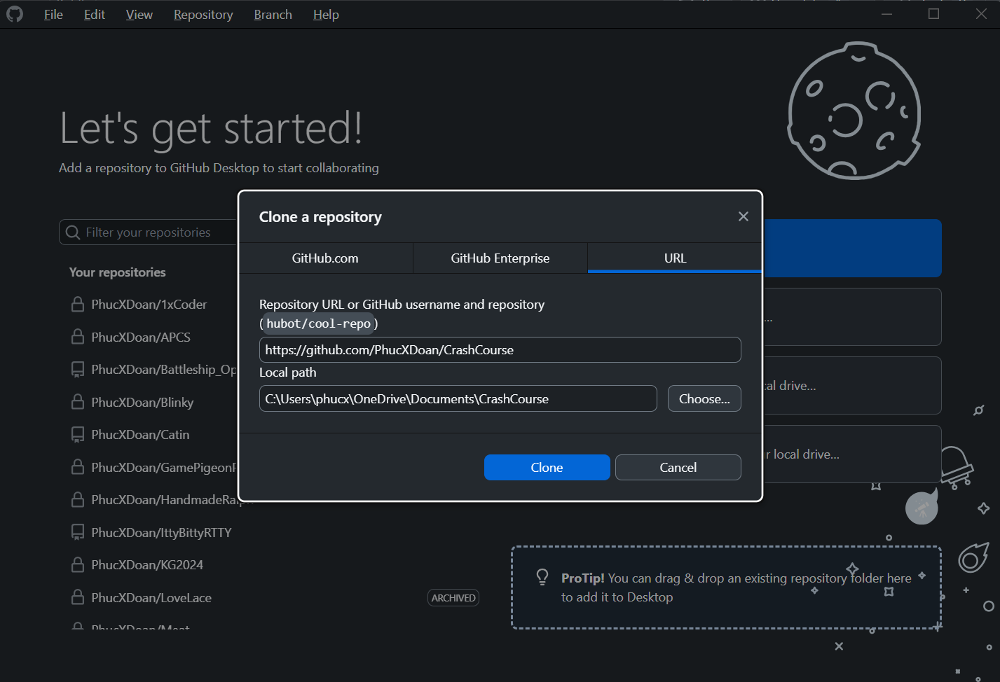

# Summer 2025 Crash Course for Katelyn.

# Task 0: Git Git.

Git is a program that essentially keeps track of changes to files over time.
For you though, we can keep the Git usage simple where you'll pretty much
use it to download this repository (Git jargon for "this project"),
keep it up-to-date whenever I make changes,
and maybe upload code as a way to keep track of your progress so far.

Because of this, you don't need to learn Git within the console (the traditional way);
you can take the more user-friendly approach with the [GitHub Desktop GUI](https://git-scm.com/downloads/guis).

<p align="center"></p>

Alongside downloading the GUI client,
you should also probably make a GitHub account if you don't already have one.

<p align="center"></p>

Once you sign into the GUI client,
you can go ahead and "clone" this repository into whatever directory you like.

<p align="center"></p>

By cloning,
you have a local copy of the respository on your machine.
You can make changes to the files within the respository as much as you like
and the GUI will show that.
For example, I've created the file `LICENSE.md` and the GUI makes note of it.

<p align="center"></p>

I also wrote a commit message summarizing what I did
(which is useful for my future self and other people).
I then press the big blue commit button[^1] to officate the changes I've made so far.

However, this commit I've made is *only local to my machine*.
This means you won't see my new `LICENSE.md` file I've created yet.
To actually upload it online (that is, to the GitHub website),
I need to then **push** my changes[^2].

<p align="center"></p>

Once I do that, you'll be able to see my commit on GitHub!

<p align="center"></p>

Now, if you cloned the repository before I pushed the commit to GitHub,
you'd have an out-of-date local copy of the repository on your machine.
This isn't a bad thing;
you just need to make the Git GUI check if there has been any new commits since then.
The GUI client will sometimes do this automatically,
but you can manually recheck by pressing the *"Fetch origin"*[^3] button at the top.

<p align="center"></p>

Once you do so, the GUI would indicate if there has been new updates to the repository.
If so, you can pull the changes into your local copy of the repository.

<p align="center"></p>

After you've made your GitHub account,
I can add you as a contributor to this repository
so you'd be allowed to push your commits here.
Besides that, that's really all there is to it!

There's plenty more to Git, of course,
like for instance:

- how can I completely erase all changes I've made to the repository, back to a clean slate?

- what if I made a typo in the commit message but I've already committed it?
Maybe even pushed it to GitHub?

- what if I made some commits and tried to push them to
GitHub, but there were commits already online that I didn't fetch and pull beforehand?

- etc.

But I won't show belabor Git anymore, because chances are you won't remember it.
Things like these are best learned when you actually apply it to a real situation.
But if you still want to learn more, try figuring out the answers to the bullets above.[^4]

[^1]: The word "master" in *"Commit 1 file to **master**"* refers to
the main branch of the repository.
There can be multiple branches in a repository which allows for the
project to slowly "diverge" in terms of features or whatever,
and later on the branches would be merged together to become one again.
The term "master" is also slowly being phased out in favor for "main",
so you might hear "main" branch rather than the "master" branch.

[^2]: This workflow of "commit then push" is because
you don't need GitHub to use Git.
That is, you can use Git to keep track of your personal project
that's just local to your computer.
Also, it also means you can work on a project and commit without an internet connection,
or if the connection is slow, you'd want to pool up several commits before pushing them
all to GitHub.

[^3]: The word "origin" refers to the main place where the repository is being hosted.
In this case, it's GitHub, but it needs not be.
It could be on your top-secret company's servers for instance.

[^4]: You can directly add and modify files of the repository on GitHub
and thus make commits that your local copy of the repository wouldn't have.
Maybe go ahead and reword some sentences you found confusing or fix some typos.
This is a good way to play around with the routine of fetching and pulling changes
through the GUI client.

# Task 1: Using brain more.

REPL stands for Read-Evalulate-Print-Loop.
The idea is that you have a command-line program
that prompts the user for some sort of expression.
The REPL program would take this input, interpret it,
evaluate it, print the result, and then prompt the user for the next input.
For instance, a simple example of a REPL program could do some basic math operations:
```
> 2 + 2
4

> 3 * 4
12
```

... be able to handle operator precedence (think PEMDAS) and have subexpressions:
```
> (5 - 2 * 10) / 4
-3.25

> 2 - 2^2 * 2
-6
```

... even have some built-in functions:
```
> abs((5 - 2 * 10) / 4)
3.25

> sqrt(4)
2
```

... and even variables defined by the user:
```
> a = 3
a = 3

> b = 5
b = 5

> c = -2
c = -2

> a + b + c
6

> (-b + sqrt(b^2 - 4 * a * c)) / (2 * a)
1.434258545910665
```

Python has a REPL program too; you simply run the `python`[^5] command in
the shell/terminal/console and then you can type some Python code line-by-line and have it
be evaluated each time you press enter.
I highly suggest you play with that a bit
to further familiarize yourself with the idea of REPL.

<p align="center"></p>

[^5]: ... or maybe `python3`; this is because of a weird backward-compatibility thing.

Your goal then would be to make a REPL program as described above using Python.
It should be able to prompt the user for input,
be able to print out the correct calculation,
maybe give an error message if the input is malformed, etc.

The exact requirements and tiny details are left all up to you;
if you do well, you can do more advance things like implementing factorial:
```
> (2 + 2)!
24
```

... be able to use the previous calculation's results:
```
> (2 + 2)!
24

> ANS
24

> ANS / 2
12

> ANS / 2
6

> ANS
6
```

... have user-defined functions:
```
> squared(x) = x * x

> squared(9)
81

> average(a, b) = (a + b) / 2

> average(3, 5)
4

> squared(average(3, 5))
16
```

... and have physical units:
```
> 10 [m/s^2] * 1.5[s]
15[m/s]

> 60[m] / 15[m/s]
4[s]

> 60[m] + 15[m/s]
ERROR: Adding [m] and [m/s]!
```

You do not have to implement all of these things;
the purpose of this task is to learn how can we
break complicated problems,
like implementing this REPL program,
into something more managable.

As first step, I'd suggest you explore the problem space a bit.
Imagine if *you* were the computer;
how would you parse the user's input to produce the expected output?
Work on intution first, then maybe formalize it into code later.

But you'll still likely need a start somewhere,
so see the hints when you're ready.

> **Expected time to complete: 1 week.**
